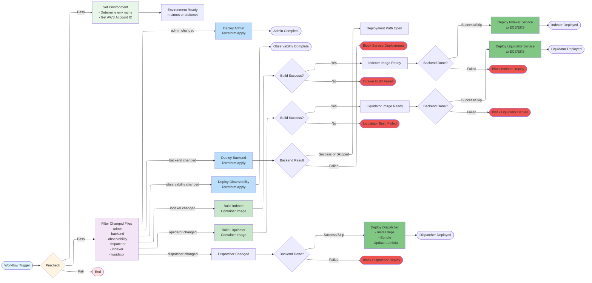

```mermaid
---
config:
  layout: elk
---
flowchart LR
    Start(["Workflow Trigger"]) --> PreCheck{"Precheck"}
    PreCheck -- Pass --> SetEnv["Set Environment<br>- Determine env name<br>- Get AWS Account ID"] & Filter["Filter Changed Files<br>- admin<br>- backend<br>- observability<br>- dispatcher<br>- indexer<br>- liquidator"]
    PreCheck -- Fail --> End(["End"])
    SetEnv --> EnvReady["Environment Ready<br>mainnet or stokenet"]
    Filter -- admin changed --> DeployAdmin["Deploy Admin<br>Terraform Apply"]
    Filter -- backend changed --> DeployBackend["Deploy Backend<br>Terraform Apply"]
    Filter -- observability changed --> DeployObs["Deploy Observability<br>Terraform Apply"]
    Filter -- indexer changed --> BuildIndexer["Build Indexer<br>Container Image"]
    Filter -- liquidator changed --> BuildLiquidator["Build Liquidator<br>Container Image"]
    DeployAdmin --> AdminDone(["Admin Complete"])
    DeployObs --> ObsDone(["Observability Complete"])
    BuildIndexer --> BuildIndexerDone{"Build Success?"}
    BuildLiquidator --> BuildLiquidatorDone{"Build Success?"}
    DeployBackend --> BackendDone{"Backend Result"}
    BackendDone -- Success or Skipped --> DeployPath["Deployment Path Open"]
    BackendDone -- Failed --> BlockDeploy(["Block Service Deployments"])
    BuildIndexerDone -- Yes --> IndexerReady["Indexer Image Ready"]
    BuildIndexerDone -- No --> IndexerFailed(["Indexer Build Failed"])
    BuildLiquidatorDone -- Yes --> LiquidatorReady["Liquidator Image Ready"]
    BuildLiquidatorDone -- No --> LiquidatorFailed(["Liquidator Build Failed"])
    IndexerReady --> WaitBackend1{"Backend Done?"}
    LiquidatorReady --> WaitBackend2{"Backend Done?"}
    WaitBackend1 -- Success/Skip --> DeployIndexer["Deploy Indexer Service<br>to ECS/EKS"]
    WaitBackend2 -- Success/Skip --> DeployLiquidator["Deploy Liquidator Service<br>to ECS/EKS"]
    WaitBackend1 -- Failed --> BlockIndexer(["Block Indexer Deploy"])
    WaitBackend2 -- Failed --> BlockLiquidator(["Block Liquidator Deploy"])
    Filter -- dispatcher changed --> DispatcherPath["Dispatcher Changed"]
    DispatcherPath --> WaitBackend3{"Backend Done?"}
    WaitBackend3 -- Success/Skip --> DeployDispatcher["Deploy Dispatcher<br>- Install deps<br>- Bundle<br>- Update Lambda"]
    WaitBackend3 -- Failed --> BlockDispatcher(["Block Dispatcher Deploy"])
    DeployIndexer --> IndexerComplete(["Indexer Deployed"])
    DeployLiquidator --> LiquidatorComplete(["Liquidator Deployed"])
    DeployDispatcher --> DispatcherComplete(["Dispatcher Deployed"])

    style Start fill:#e1f5ff
    style PreCheck fill:#fff4e1
    style SetEnv fill:#e8f5e9
    style Filter fill:#f3e5f5
    style End fill:#ffe1e1
    style DeployAdmin fill:#bbdefb
    style DeployBackend fill:#bbdefb
    style DeployObs fill:#bbdefb
    style BuildIndexer fill:#c8e6c9
    style BuildLiquidator fill:#c8e6c9
    style BlockDeploy fill:#ef5350
    style IndexerFailed fill:#ef5350
    style LiquidatorFailed fill:#ef5350
    style DeployIndexer fill:#81c784
    style DeployLiquidator fill:#81c784
    style BlockIndexer fill:#ef5350
    style BlockLiquidator fill:#ef5350
    style DeployDispatcher fill:#81c784
    style BlockDispatcher fill:#ef5350
```