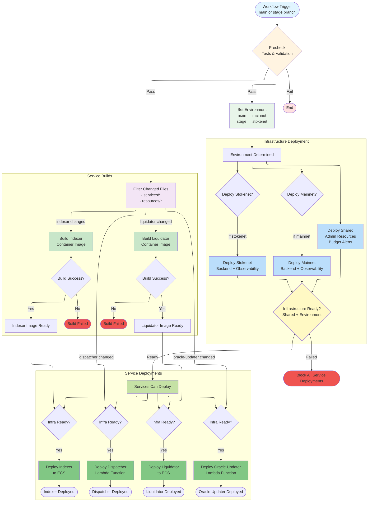

## Pipeline Overview

### Triggers
- **Push to `main`**: Deploys to mainnet environment
- **Push to `stage`**: Deploys to stokenet environment
- **Manual dispatch**: Choose environment

### Key Features

#### Concurrency Controls
- Top-level: `deploy-${{ github.ref }}` - Queues deployments from same branch
- Per-environment: `mainnet-deployment`, `stokenet-deployment`, `shared-deployment`
- Prevents Terraform state conflicts

#### Infrastructure-Ready Gate
Single gate job that verifies:
- ✅ Shared resources deployed successfully
- ✅ Correct environment (mainnet OR stokenet) deployed successfully
- ⛔ Blocks all service deployments if infrastructure fails

#### Path Filters
Services only build/deploy when their code changes:
- `services/containers/indexer/**`
- `services/containers/liquidator/**`
- `services/functions/dispatcher/**`
- `services/functions/oracle-updater/**`

### Deployment Sequence

1. **Validation** (on PR): Tests + Terraform validate
2. **Environment Selection**: Determine mainnet or stokenet
3. **Infrastructure**:
   - Deploy shared (always)
   - Deploy mainnet (if main branch)
   - Deploy stokenet (if stage branch)
4. **Infrastructure Gate**: Verify all infrastructure succeeded
5. **Service Builds**: Build changed container images
6. **Service Deployments**: Deploy services to correct environment

